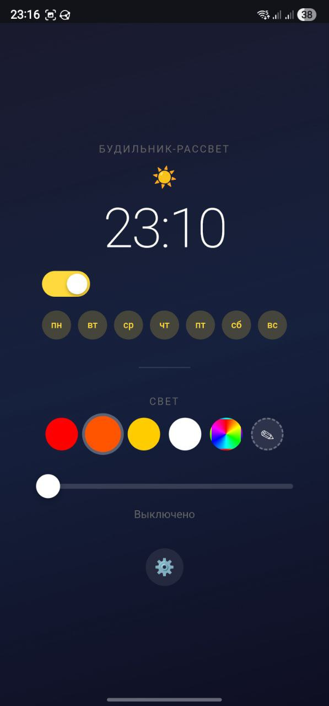
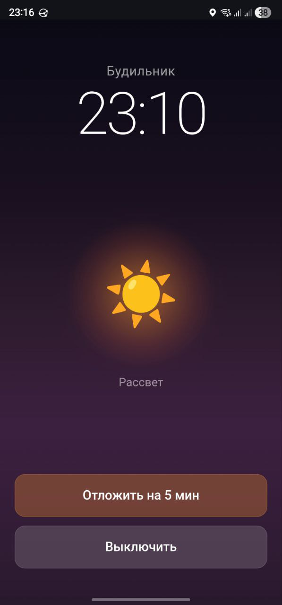
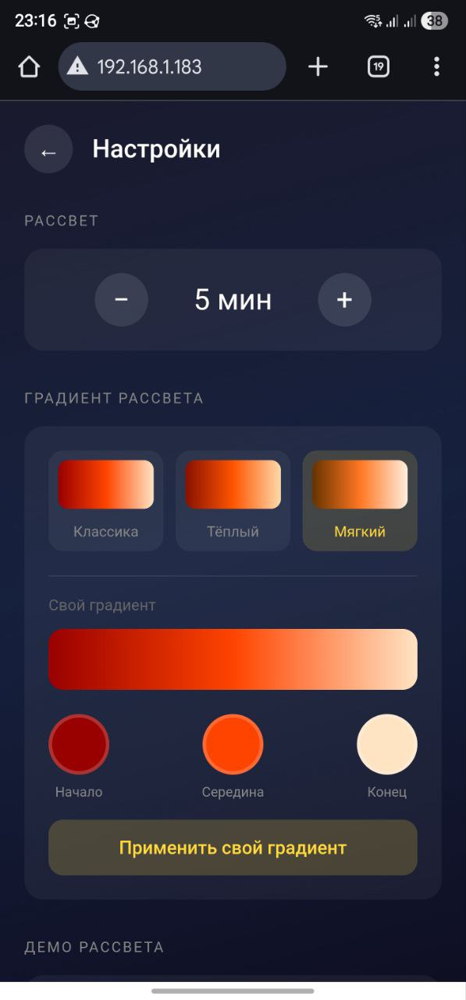
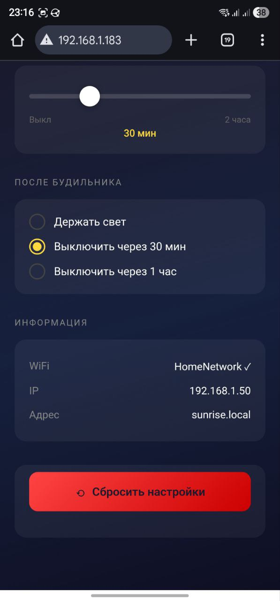

# Sunrise Alarm Clock

Умный будильник-рассвет на ESP8266 с веб-интерфейсом.

## Скриншоты

| Главный экран | Будильник | Настройки | Настройки | Настройки |
|:---:|:---:|:---:|:---:|:---:|
|  |  |  |  |  |

## Возможности

- Симуляция рассвета перед будильником
- Веб-интерфейс (PWA) — `http://sunrise.local`
- Выбор дней недели, пресеты цветов, радуга
- Отложить будильник (+5 мин), автовыключение, синхронизация NTP

## Железо

- ESP8266 (NodeMCU/Wemos D1)
- WS2812B адресная лента (180 шт)
- DS3231 RTC модуль

### Подключение

```
BREADBOARD
         a   b   c   d   e
       ┌─────────────────────┐
    2  │ ●   ●   ○   ○   ○   │  D1 + SCL
    3  │ ●   ●   ○   ○   ○   │  D2 + SDA
    5  │ ●   ●   ○   ○   ○   │  D4 + DIN ленты
    6  │ ●   ●   ○   ○   ○   │  3V + VCC
   14  │ ●   ●   ●   ○   ○   │  G + GND ленты + GND DS3231
       └─────────────────────┘

    b2 = провод мама-папа → DS3231 SCL
    b3 = провод мама-папа → DS3231 SDA
    b5 = DIN ленты (зелёный)
    b6 = провод мама-папа → DS3231 VCC
    c14 = провод мама-папа → DS3231 GND
```

Лента питается от внешнего БП 5V (GND общий с ESP).

## Установка

1. Arduino IDE + ESP8266 Board
2. Библиотеки: `Adafruit NeoPixel`, `RTClib`
3. Изменить WiFi в коде:
   ```cpp
   const char* ssid = "YOUR_WIFI";
   const char* password = "YOUR_PASSWORD";
   ```
4. Загрузить на ESP8266

## API

```bash
# Свет
curl "http://sunrise.local/light?b=50&p=orange"

# Будильник
curl "http://sunrise.local/save?h=7&m=0&en=1"

# Статус
curl "http://sunrise.local/status"
```

| Endpoint | Описание |
|----------|----------|
| `/status` | JSON настроек |
| `/save` | Сохранить будильник |
| `/light` | Управление светом |
| `/demo` | Демо рассвета |
| `/snooze` | Отложить (+5 мин) |
| `/reset` | Сброс настроек |
